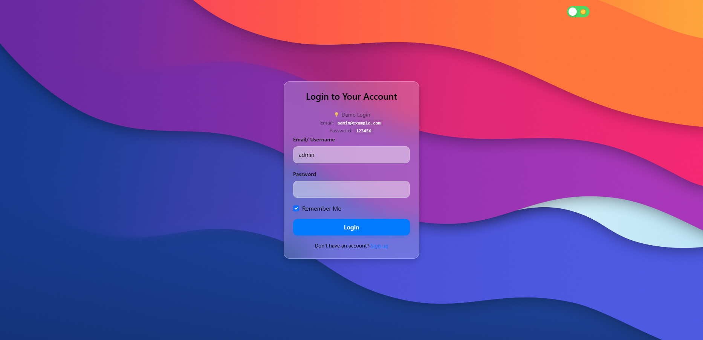
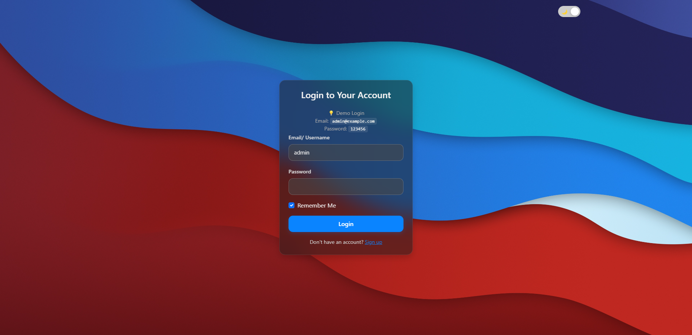
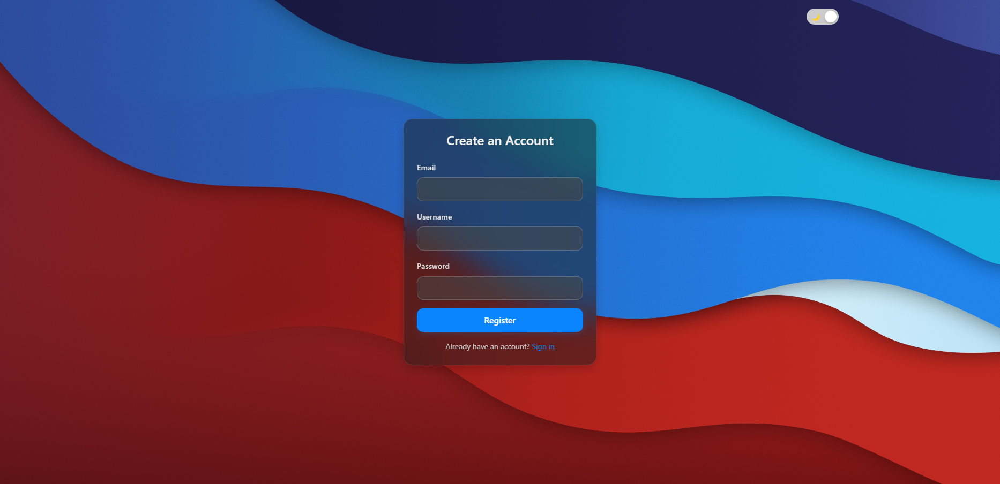

# 💻 MacOS-Style Login Page (HTML + jQuery)

An interactive MacOS-inspired login page built using only HTML, CSS, and jQuery — with no backend. This project simulates basic login and registration functionality with a sleek, modern UI and dark mode support.

---

## 🧩 Key Features

- ✅ **Login and Register Forms** with basic validation  
- 🌗 **Light/Dark Theme Toggle** with `localStorage` preference saving  
- 🔒 **Remember Me** simulates local storage of username and password  
- 🧊 **MacOS Glassmorphism Style** with `backdrop-filter` effects  
- 🪟 Success modal notifications for login/register  
- 📱 Fully responsive mobile design  

---

## 👤 Demo Account

| Type | Username / Email               | Password |
|------|--------------------------------|----------|
| Demo | `admin` or `admin@example.com` | `123456` |

---

## 📂 Project Structure

├── assets/
│ ├── css/
│ │ └── style.css
│ ├── img/
│ │ ├── dark.jpg
│ │ └── light.jpg
│ └── js/
│ └── main.js
├── partials/
│ └── navbar.html
├── index.html
├── .gitignore
└── README.md

---

## ⚙️ Getting Started

1. **Download or clone** this repository  
2. Open `index.html` in any modern browser (Chrome, Firefox, Opera, etc.)  
3. Log in with the demo account or register a dummy account (no server storage)

---

## 📌 Technical Notes

- This is a **fully frontend** application — no backend involved.  
- Login data is validated locally via a hardcoded `demoUser` in JavaScript.  
- Theme preferences are saved in `localStorage` and persist even after closing the browser.  

---

## 🛠️ Technologies Used

- HTML5 + CSS3  
- jQuery (latest version)  
- Bootstrap 5 (optional)  
- `localStorage` for lightweight client-side storage  

---

## 📸 Preview

| Light Mode | Dark Mode |
|------------|-----------|
|  |  |
|  |  |

> If screenshots are missing, you can manually add them to the `assets/screenshots/` folder.

---

## 🧑‍💻 Developer

Created by **Muhammad Rohid**

📷 Instagram: [@rohid.127](https://instagram.com/rohid.127)

---

## 📄 License

This project is licensed under the [MIT License](https://opensource.org/licenses/MIT).  
You are free to use, modify, and distribute it — please include proper attribution.

---

## ✅ Future Plans (Optional)

- [ ] Save accounts to a JSON structure and validate dynamically (for learning purposes)  
- [ ] Export as a PWA (Progressive Web App)  
- [ ] Add CSS keyframe animations for login/logout transitions  

---

> Need help uploading to GitHub? I can assist with `git init`, `.gitignore`, and push steps.
